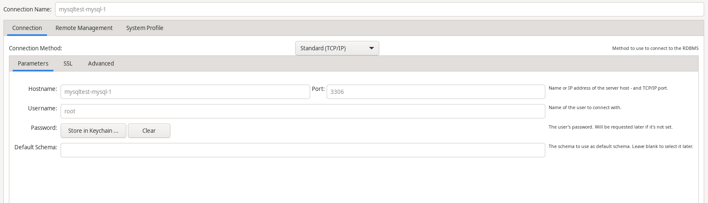

# MySQL5.6とMySQL8.0をためす

* MySQL5.6 ポート 3305で起動
* MySQL8.0 ポート 3306で起動
* linuxserver/MySQLWorkbenchを試しに

## linuxserver/mysql-workbench の起動

* http://localhost:3000
* https://localhost:3001

### connection settigs

* Dockerインスタンスの名前を確認する

```sh
$> docker compose ps
```

| NAME | IMAGE | COMMAND | SERVICE | CREATE | STATUS |
| --- | --- | --- | --- | --- | --- |
|mysql-workbench|lscr.io/linuxserver/mysql-workbench:latest|"/init"|mysql-workbench|About a minute ago   Up About a minute|0.0.0.0:3000-3001->3000-3001/tcp, :::3000-3001->3000-3001/tcp|
|mysqltest-mysql-1|mysql:8.0.27|"docker-entrypoint.s..."|mysql|About a minute ago   Up About a minute|0.0.0.0:3306->3306/tcp, :::3306->3306/tcp, 33060/tcp|
|mysqltest-mysql_56-1|mysql:5.6.51|"docker-entrypoint.s..."|mysql_56|About a minute ago   Up About a minute|0.0.0.0:3305->3306/tcp, :::3305->3306/tcp|

* NAMEをHOSTに設定する。



## コンテナ起動

```sh
# start
$> cd home/user/mysqltest/
$> docker compose up -d

# stop
$> cd home/user/mysqltest/
$> docker compose stop
```

## 出典
* [Docker Hub MySQL](https://hub.docker.com/_/mysql)
* [linuxserver/mysql-workbench](https://hub.docker.com/r/linuxserver/mysql-workbench)
